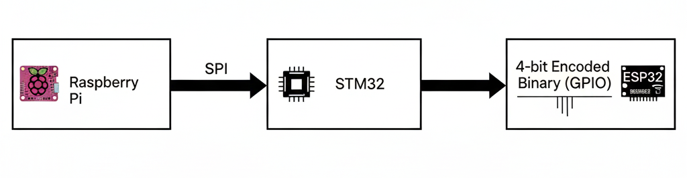

# Rokai: Autonomous Navigation Robot with Distributed Computing

This project implements an autonomous navigation system on a differential drive robot ("Rokai"), utilizing a **Host-Controller distributed computing architecture** to avoid obstacles detected by LIDAR and reach a target point.

*Demo video/GIF coming soon.*

---

## 🎯 Objective

The main goal is to implement a distributed system where tasks are delegated to different processors based on their complexity and real-time requirements:
* **Host (Raspberry Pi):** High-level planning, complex sensor processing (LIDAR), navigation logic. Does not require strict real-time performance.
* **Controller (STM32):** Low-level execution, motor control, encoder reading, odometry calculation. Requires **strict real-time performance**.
* **Co-Processor (ESP32):** Secondary, non-critical tasks (light control).

---

## 🛠️ System Architecture (Host-Controller)

The robot employs a classic Host-Controller model common in robotics, communicating via SPI:

### 1. Host (Raspberry Pi 5)
* **Language:** Python
* **Main Tasks:**
    * **LIDAR Reading (Dedicated Thread):** A thread (`osensores.py` or `lidar_reader.py`) continuously reads the YDLIDAR asynchronously to avoid blocking the main control loop. Uses `threading` and `Lock` for safe data sharing.
    * **Planning and Control (Main Control Thread):** The `main_robot.py` script (running at ~200Hz):
        * Gets the latest LIDAR data.
        * Receives the current odometry from the STM32.
        * Calculates **Artificial Potential Field** forces (attraction to the goal `xd, yd` and repulsion from obstacles).
        * Sends the resulting velocity vector (`ux_global`, `uy_global`) and `maxspeed` to the STM32 via SPI.
* **Key Libraries:** `spidev`, `numpy`, `threading`.

### 2. Main Controller (STM32G474CEU6)
* **Language:** C (with STM32 HAL)
* **Operating System:** FreeRTOS
* **Main Tasks (Managed by FreeRTOS):**
    * **`vControlTask` (High Priority):** Executes strictly every **2ms** (`vTaskDelayUntil`). Responsible for:
        * Reading quadrature encoders (using Hardware Timers).
        * Calculating angular velocity (`w1`, `w2`).
        * Filtering velocity noise (1st Order IIR Filter).
        * Running the speed **PI Controller** for each motor (with Anti-Windup).
        * Calculating **Odometry** (`x`, `y`, `th`), protecting shared variables with `taskENTER_CRITICAL`.
        * Generating PWM signals for motor drivers.
    * **`vLedTask` (Low Priority):** Runs less frequently (~100ms). Encodes the robot's state (e.g., moving, stopped, near obstacle) and sends it via UART to the ESP32 for visual feedback (lights), without interrupting critical control.
* **Communication:** Receives commands via SPI (protected in ISR with `taskENTER_CRITICAL_FROM_ISR`) and sends state via UART.

### 3. Co-Processor (ESP32)
* **Language:** C++ (Arduino Framework/ESP-IDF)
* **Main Task:** Receives UART messages from the STM32, decodes the robot's state, and controls LEDs (e.g., Neopixels) to visually indicate the robot's actions.

---

## 🔩 Hardware Used

* **Host Computer:** Raspberry Pi 5
* **Distance Sensor:** YDLIDAR (Specify model, e.g., X4, G4)
* **Main Controller:** Board with STM32G474CEU6
* **Secondary Controller:** ESP32 Module
* **Actuators:** Differential drive robot chassis, 2x DC Motors with Quadrature Encoders, Motor Drivers (H-Bridge).
* **Communication:** Wiring for SPI and UART.

---

## 📂 Repository Structure
